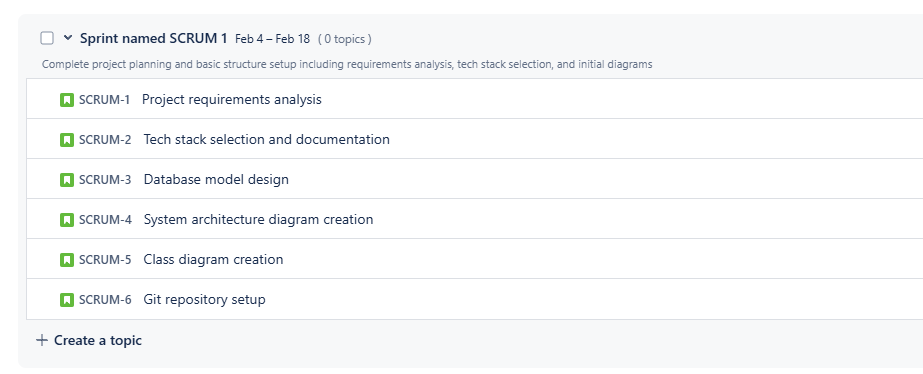
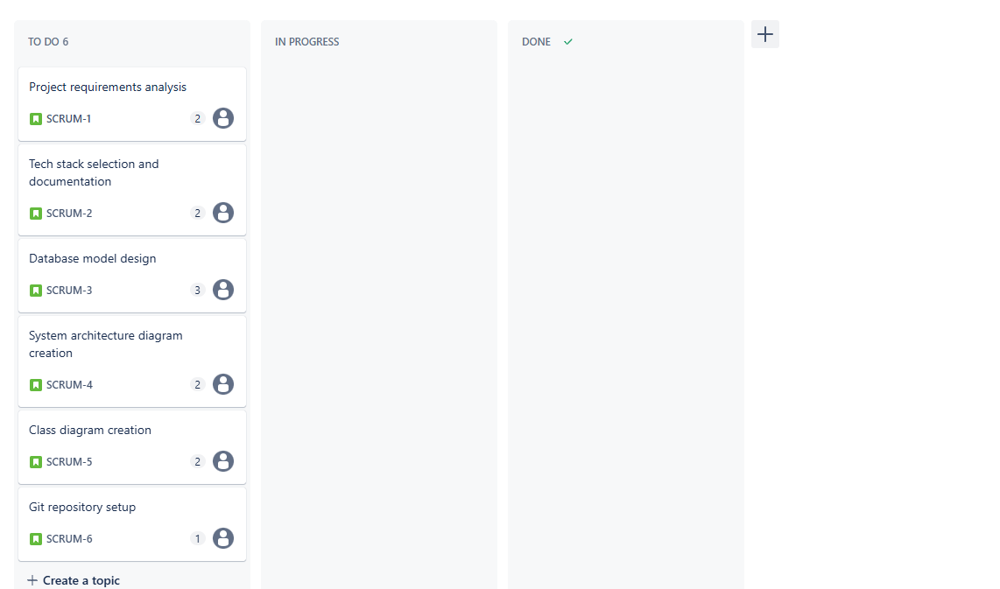
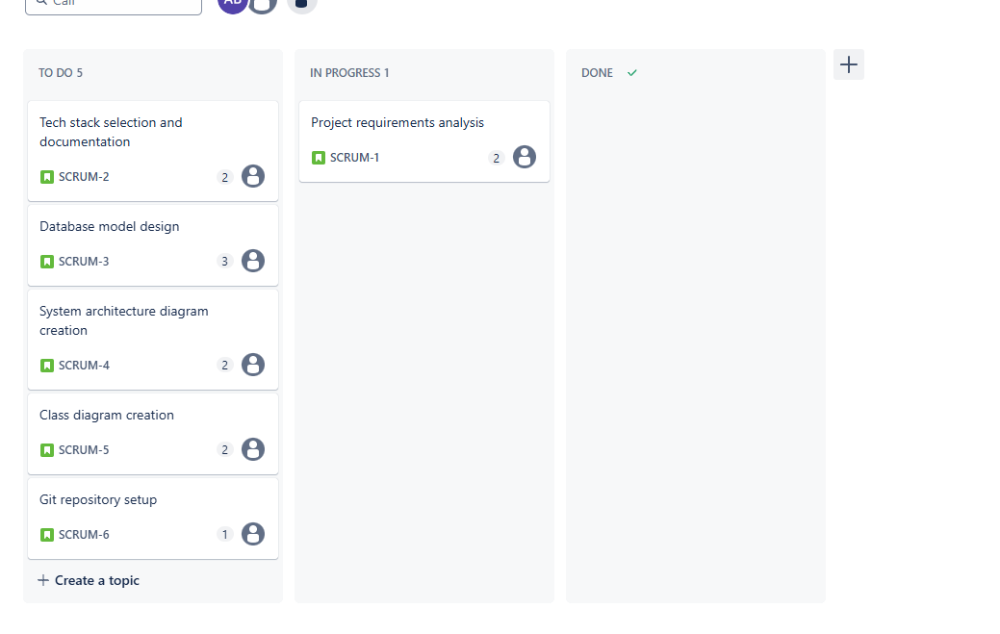
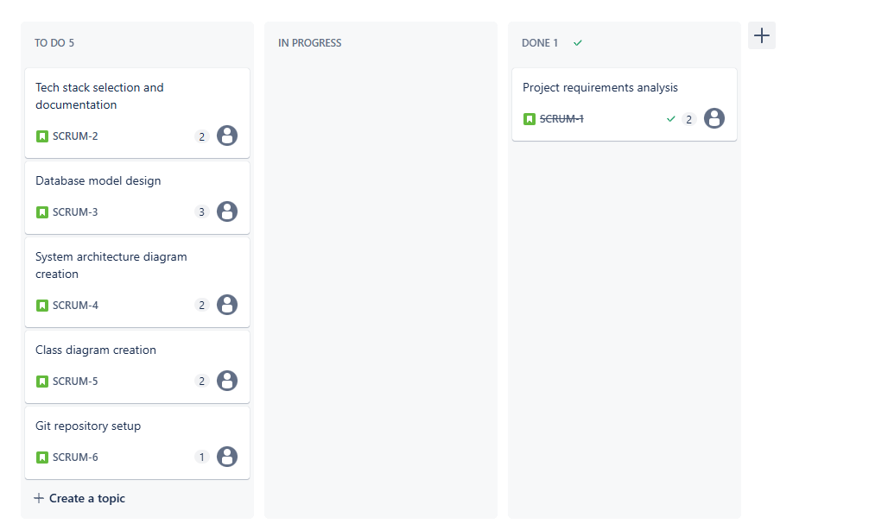
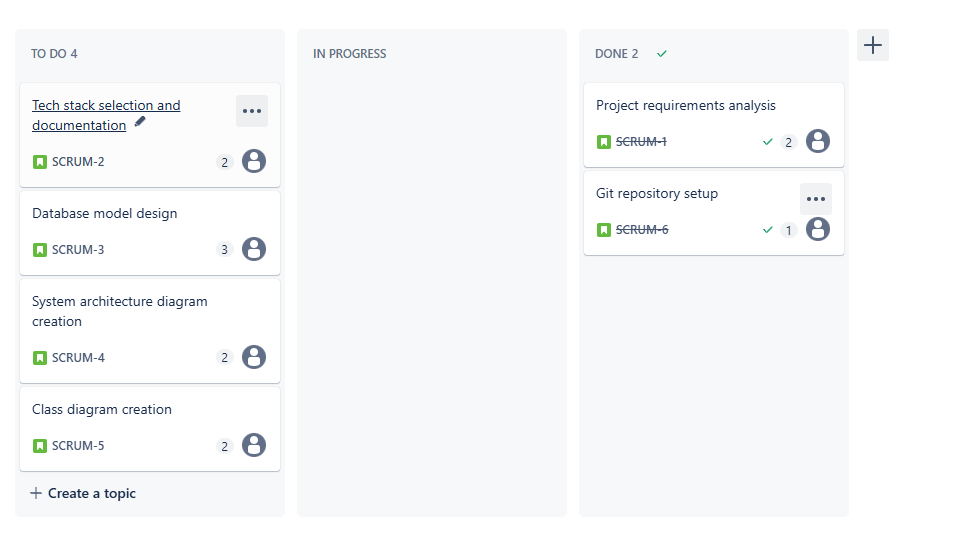
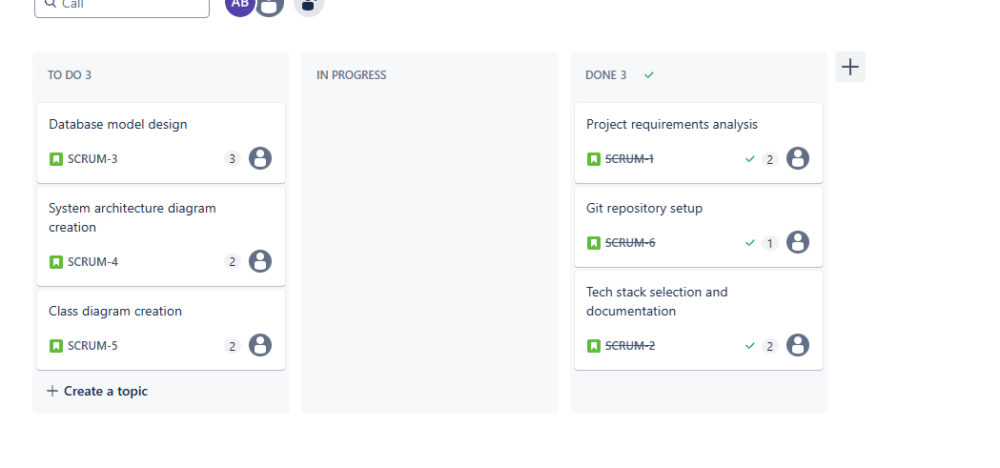
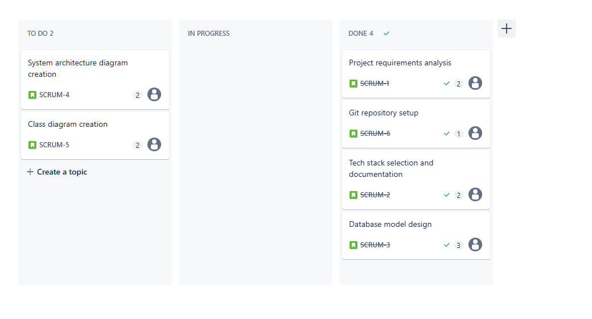
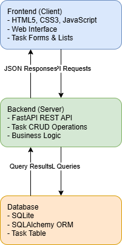
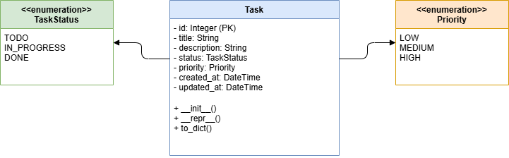
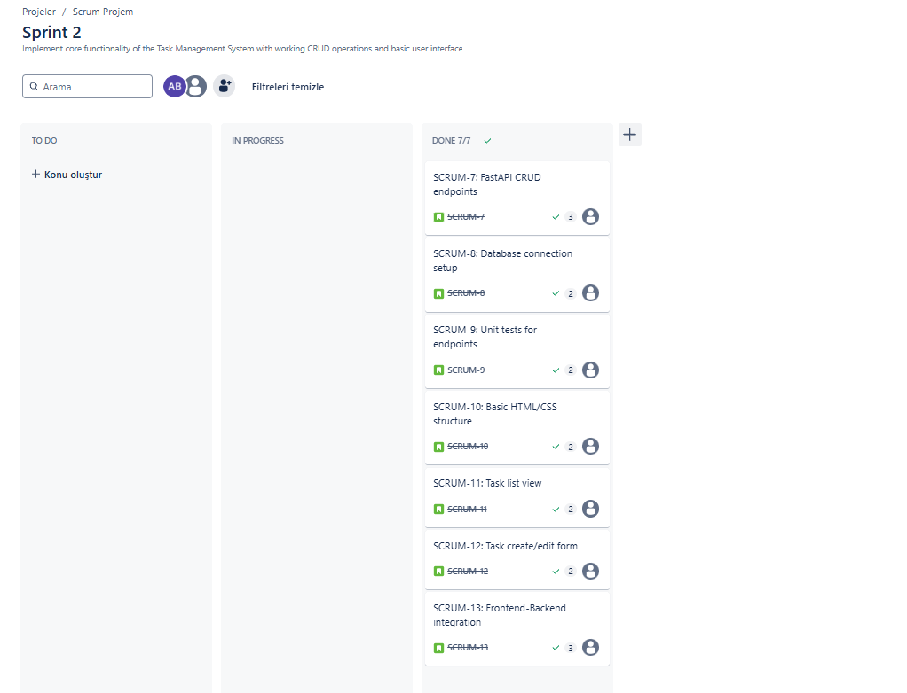

# IT Course Project

## Project Overview
This project is developed as part of the IT course, focusing on implementing software development practices using the SCRUM framework.

## Team Member
- **Name:** Ahmet Artun Bostan
- **Student ID:** 39810

## Project Description
This project will be developed over multiple SCRUM sprints (3-4) throughout the semester. The development process will follow Agile methodologies and utilize various tools and practices including:

- JIRA for project management and task tracking
- Git for version control
- Draw.io for creating diagrams and schematics

### Technical Requirements
- Implementation of CRUD operations for at least one entity
- Unit testing implementation
- Documentation of both functional and non-functional requirements
- Technical stack documentation

## Project Structure
```
├── docs/           # Documentation files
│   └── diagrams/   # Draw.io diagrams
├── src/            # Source code
├── tests/          # Test files
└── README.md       # Project documentation
```

## Requirements

### Functional Requirements
1. Task Management
   - Users can create new tasks with title, description, and priority
   - Users can view all existing tasks
   - Users can update task status and details
   - Users can delete tasks
   - Tasks have different priority levels (low, medium, high)
   - Tasks have different status states (todo, in progress, completed)

2. User Interface
   - Web-based interface for task management
   - Responsive design for different screen sizes
   - Intuitive task creation form
   - Visual indicators for task priority and status

### Non-Functional Requirements
1. Performance
   - Task operations should complete within 2 seconds
   - System should handle up to 1000 tasks efficiently

2. Security
   - Input validation for all form submissions
   - Protection against common web vulnerabilities

3. Reliability
   - System should be available 99% of the time
   - Data persistence using SQLite database

4. Maintainability
   - Well-documented code with comments
   - Modular architecture for easy updates
   - Unit tests for core functionality

## Technical Stack
- Backend: Python FastAPI
- Database: SQLite
- Frontend: HTML5, CSS3, JavaScript
- Testing: pytest
- Version Control: Git
- Project Management: JIRA
- Documentation: Markdown, Draw.io

## Development Process
1. Requirements gathering and documentation
2. Technical stack selection
3. Implementation of core functionality
4. Unit testing
5. Documentation updates

## SCRUM Process Documentation

*Note: Sprint dates are sample dates used for demonstration purposes.*

### Sprint 1 (Feb 4 - Feb 18, 2025)

#### Sprint Goal
Complete project planning and basic structure setup including requirements analysis, tech stack selection, and initial diagrams

#### Sprint Backlog
1. Project requirements analysis (2 points) 
2. Tech stack selection and documentation (2 points) 
3. Database model design (3 points) 
4. System architecture diagram creation (2 points) 
5. Class diagram creation (2 points) 
6. Git repository setup (1 point) 

Total Story Points: 12 (All Completed! )

#### Sprint Board Screenshots

##### Sprint Setup


##### Initial Sprint Board with Tasks


##### Sprint Started - First Task In Progress


##### First Task Completed


##### Second Task Completed


##### Third Task Completed


##### Fourth Task Completed


##### Fifth Task Completed


##### Sprint Completed - All Tasks Done


*Note: Screenshots show the complete progression of Sprint 1, from initial setup to successful completion. All 6 tasks have been moved to the DONE column, demonstrating proper use of SCRUM methodology and achieving our sprint goal of completing project planning and basic structure setup.*

### Sprint 2 (Feb 19 - Mar 4, 2025)

#### Sprint Goal
Implement core functionality of the Task Management System with working CRUD operations and basic user interface

#### Sprint Backlog
1. FastAPI CRUD endpoints (3 points) 
2. Database connection setup (2 points) 
3. Unit tests for endpoints (2 points) 
4. Basic HTML/CSS structure (2 points) 
5. Task list view (2 points)
6. Task create/edit form (2 points)
7. Frontend-Backend integration (3 points)

Total Story Points: 16

#### Sprint Board


*Note: The Task Management System has been successfully implemented with all planned features. The system now includes:*

1. **Backend Features:**
   - Full CRUD operations with FastAPI
   - SQLite database integration
   - Comprehensive error handling
   - Data validation
   - Unit test coverage

2. **Frontend Features:**
   - Modern and responsive UI
   - Task filtering and sorting
   - Real-time form validation
   - Loading states and animations
   - Success/error notifications

3. **Integration Features:**
   - Seamless frontend-backend communication
   - Optimistic UI updates
   - Error handling and recovery
   - Loading state management

The system is now ready for use, providing a smooth user experience for managing tasks with proper validation, error handling, and responsive design.

## Project Documentation

### System Architecture
The system follows a client-server architecture with a clear separation of concerns:


### Class Diagram
The following class diagram shows the data models and their relationships:


## Getting Started
1. Clone the repository
2. Install dependencies:
   ```bash
   pip install -r requirements.txt
   ```
3. Run database migrations:
   ```bash
   alembic upgrade head
   ```
4. Start the server:
   ```bash
   uvicorn src.main:app --reload --port 8080
   ```

## Running Tests
To run the unit tests:
```bash
pytest tests/ -v
```

## Tools and Technologies
- **Backend Framework**: FastAPI (Python)
- **Database**: SQLite with SQLAlchemy ORM
- **Frontend**: HTML5, CSS3, JavaScript
- **Testing**: pytest
- **Version Control**: Git
- **Project Management**: JIRA
- **Documentation**: Markdown, PlantUML

---
*This README will be updated as the project progresses with more specific information about the implementation and functionality.*
